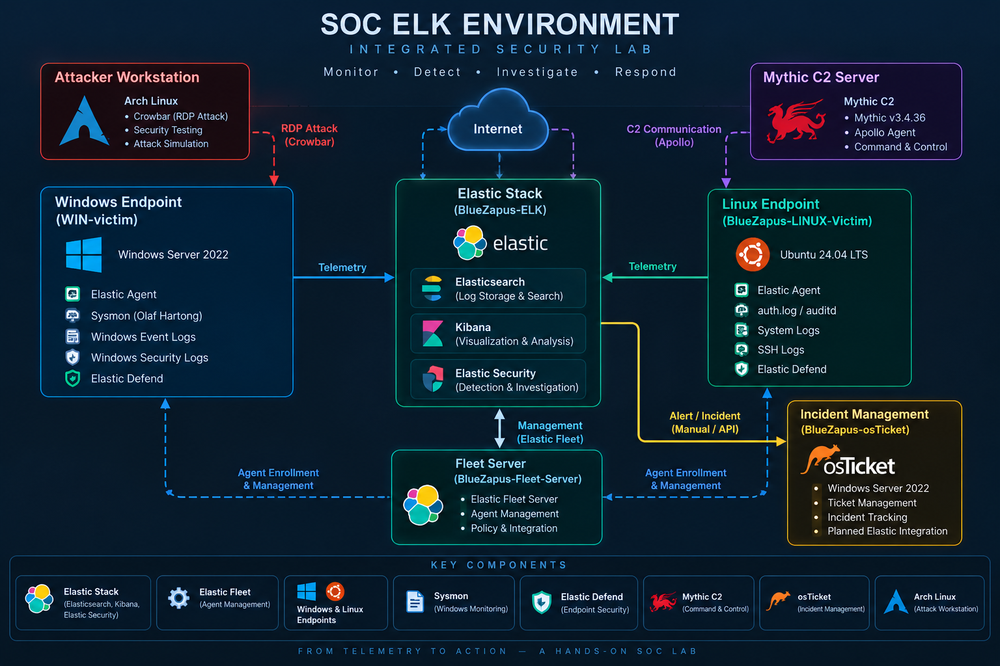
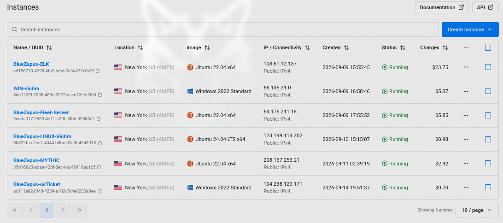

# SOC ELK Environment

A hands-on **Security Operations Center (SOC) lab** built using the Elastic Stack to practice centralized security monitoring, endpoint telemetry collection, attack simulation, detection, investigation, and incident management.

The environment combines **Elasticsearch, Kibana, Elastic Security, Fleet Server, Elastic Agent, Sysmon, Elastic Defend, Mythic C2, and osTicket** across Windows and Linux systems deployed primarily on Vultr Cloud.

---

## Architecture



The core SOC infrastructure runs inside a Vultr environment using a private VPC (`172.31.0.0/24`), while attack simulations are performed from a local Arch Linux workstation.


---

## Infrastructure



| System                   | Operating System    | Role                                     |
| ------------------------ | ------------------- | ---------------------------------------- |
| `BlueZapus-ELK`          | Ubuntu 22.04        | Elasticsearch, Kibana & Elastic Security |
| `BlueZapus-Fleet-Server` | Ubuntu 22.04        | Elastic Fleet Server                     |
| `WIN-victim`             | Windows Server 2022 | Windows monitored endpoint               |
| `BlueZapus-LINUX-Victim` | Ubuntu 24.04 LTS    | Linux monitored endpoint                 |
| `BlueZapus-MYTHIC`       | Ubuntu 22.04        | Mythic C2 infrastructure                 |
| `BlueZapus-osTicket`     | Windows Server 2022 | Incident management                      |
| Attacker Workstation     | Arch Linux          | Controlled attack simulation             |

---

## Technology Stack

**SIEM & Monitoring**

`Elasticsearch` · `Kibana` · `Elastic Security` · `Elastic Fleet` · `Elastic Agent`

**Endpoint Telemetry**

`Sysmon` · `Elastic Defend` · `Windows Event Logs` · `Linux auth.log` · `auditd` · `SSH Logs`

**Attack Simulation**

`Arch Linux` · `Crowbar` · `Mythic C2` · `Apollo`

**Incident Management**

`osTicket`

**Infrastructure**

`Vultr Cloud` · `VPC Networking` · `Vultr Firewall` · `Ubuntu Server` · `Windows Server`

---

## Monitoring Architecture

Elastic Fleet provides centralized management for Elastic Agents installed on the Windows and Linux endpoints.

Endpoint telemetry is forwarded to Elasticsearch and analyzed through Kibana and Elastic Security.

```text
Endpoint Activity
       │
       ▼
 Elastic Agent
       │
       ▼
 Elasticsearch
       │
       ▼
Elastic Security
       │
       ▼
Detection / Investigation
```

### Windows Telemetry

`WIN-victim` was configured with:

- Elastic Agent
    
- Elastic Defend
    
- Windows Event Logs
    
- Windows Security Logs
    
- Sysmon64
    
- Olaf Hartong Sysmon configuration
    

### Linux Telemetry

`BlueZapus-LINUX-Victim` was configured with:

- Elastic Agent
    
- Elastic Defend
    
- `auth.log`
    
- `auditd`
    
- System logs
    
- SSH authentication logs
    

---

## Attack Simulation

The lab includes controlled offensive activity to generate realistic security telemetry.

### RDP Authentication Activity

A local **Arch Linux** workstation was used as the attacker machine, with **Crowbar** generating controlled RDP authentication activity against `WIN-victim`.

```text
Arch Linux
    │
  Crowbar
    │
    ▼
WIN-victim
```

### Mythic C2

A dedicated Mythic server was deployed to simulate Command-and-Control activity.

A working **Apollo callback** was successfully established from:

```text
Host   : WIN-VICTIM
User   : Administrator
Agent  : Apollo
C2     : Mythic
```

This allowed C2-related endpoint activity to be generated while the Windows system remained monitored by Elastic.

---

## Security Investigation

Collected telemetry was investigated through Kibana and Elastic Security.

One example involved repeated failed SSH authentication events against the Linux endpoint.

```text
agent.name : "BlueZapus-LINUX-Victim"
```

combined with:

```text
system.auth.ssh.event : "Failed"
```

returned hundreds of failed authentication events from multiple external source addresses.

The investigation included fields such as:

- Timestamp
    
- Source IP
    
- Source country
    
- Target username
    
- Authentication result
    

This demonstrates the workflow from **raw endpoint telemetry to centralized SOC investigation**.

---

## Incident Management

osTicket was deployed as the incident-management component of the environment.

The intended workflow was:

```text
Elastic Security
       │
       ▼
Detection / Alert
       │
       ▼
SOC Investigation
       │
       ▼
    osTicket
       │
       ▼
Incident Tracking
```

The final development stage was intended to automate:

**Elastic Security Alert → API → osTicket Ticket**

The osTicket platform was successfully deployed, but the API automation was **not completed** before the cloud environment was discontinued.

---

## Project Highlights

- Multi-server SOC environment deployed on Vultr
    
- Private `172.31.0.0/24` VPC
    
- Dedicated Elasticsearch/Kibana server
    
- Dedicated Elastic Fleet Server
    
- Windows and Linux endpoint monitoring
    
- Centralized Elastic Agent management
    
- Windows Sysmon telemetry using Olaf Hartong configuration
    
- Elastic Defend integration
    
- Linux SSH and authentication monitoring
    
- Centralized security investigation using Kibana
    
- Controlled RDP authentication simulation using Crowbar
    
- Dedicated Mythic C2 infrastructure
    
- Successful Apollo callback from `WIN-VICTIM`
    
- osTicket incident-management deployment
    
- Cloud firewall and service exposure configuration
    

---

## Documentation

Detailed technical documentation is available in the `docs` directory.

|Document|Description|
|---|---|
|Architecture|Infrastructure, network topology, firewall, and system architecture|
|ELK Stack & Fleet|Elasticsearch, Kibana, Fleet Server, agents, and telemetry flow|
|Endpoint Monitoring|Windows/Linux monitoring, Sysmon, auditd, and Elastic Defend|
|Attack & Detection|Crowbar, Mythic C2, telemetry analysis, and SOC investigation|
|Incident Response|osTicket and incident-management workflow|
|Project Status|Implementation status, limitations, and final results|

---

## Project Status

**Partially Completed — Core SOC Environment Operational**

The following core components were successfully implemented and validated:

[✓] Vultr cloud infrastructure
[✓] Private VPC
[✓] Elasticsearch & Kibana
[✓] Elastic Security
[✓] Fleet Server
[✓] Windows endpoint monitoring
[✓] Linux endpoint monitoring
[✓] Sysmon telemetry
[✓] Elastic Defend
[✓] Linux authentication monitoring
[✓] Crowbar attack simulation
[✓] Mythic C2 deployment
[✓] Apollo callback
[✓] osTicket deployment
[✓] Elastic → osTicket API automation

Development stopped during the Elastic-to-osTicket API integration stage after the Vultr cloud environment reached its billing limit and the instances were suspended.

The repository documents the final state of the environment and distinguishes between **implemented, validated, and planned functionality**.

---

## Skills Demonstrated

`SOC Monitoring` · `SIEM` · `Elastic Stack` · `Elastic Security` · `Kibana` · `Fleet` · `Sysmon` · `Windows Security Monitoring` · `Linux Security Monitoring` · `Log Analysis` · `KQL` · `Incident Investigation` · `VPC Networking` · `Cloud Firewall` · `Mythic C2` · `Attack Simulation` · `Incident Management`

---

## Disclaimer

This environment was created exclusively for **cybersecurity learning, SOC training, and controlled security testing**.

All attack simulations were performed against systems owned and controlled within the lab environment.